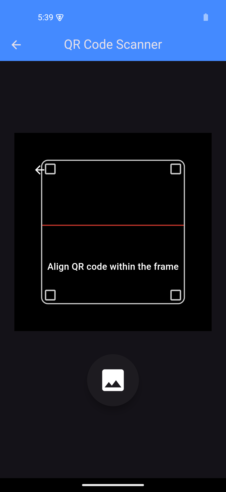

# QR Code Scanner App

This is a simple Flutter application that allows users to scan QR codes using their device's camera or by selecting an image from the gallery. The app will decode the QR code and navigate to a results screen showing the decoded data.

## Features

- **Camera QR Code Scanning**: Scan QR codes directly using the camera.
- **Gallery QR Code Scanning**: Choose an image from the gallery and scan QR codes from the selected image.
- **Responsive UI**: The user interface adapts dynamically to different screen sizes.

## Screenshots



*Home Screen with QR scanner options.*

## Installation

1. Clone the repository to your local machine:

   ```bash
   git clone https://github.com/santoshvandari/QRScannerAPK.git
   ```

2. Navigate to the project directory:

   ```bash
   cd QRScannerAPK
   ```

3. Install dependencies:

   ```bash
   flutter pub get
   ```

4. Run the app on your emulator or physical device:

   ```bash
   flutter run
   ```

## Permissions

The app requires camera permissions to scan QR codes. If the permission is not granted, the app will prompt the user to allow camera access.

**Required Permissions**:

- **Camera Permission**: To scan QR codes using the device's camera.

For Android, ensure that the following permissions are added in the `AndroidManifest.xml`:

```xml
<uses-permission android:name="android.permission.CAMERA" />
```


## Packages Used

- `flutter`: The Flutter framework for building the app.
- `mobile_scanner`: A Flutter package to scan QR codes using the device camera.
- `image_picker`: A package to pick images from the gallery.

## Installation
To install the app on your Android device:
1. Download the latest APK from the [Releases](https://github.com/santoshvandari/qrscannerapk/releases) section.
2. Transfer the APK to your phone and install it.

## Contributing
We welcome contributions! Feel free to submit a pull request or open an issue if you find bugs or want to add new features. Check out the [Contributing Guidelines](CONTRIBUTING.md) for more information.

## License
This project is licensed under the MIT License. See the [LICENSE](LICENSE) file for details.

## Contact
For any inquiries or support, please reach out at:
- **GitHub**: [@santoshvandari](https://github.com/santoshvandari)

---

### If you like this project, don't forget to give it a ⭐ and share it with others!

### Made with ❤️ by Santosh Bhandari 

### Keep Coding Keep Smiling